## "The forgotten man"

:::{.v-center-container}
```{=revealjs}
  <center>
  <video controls loop autoplay width="700" fig-align="center">
  <source src=./media_onedrive/forgotten_bonus.mp4>
  </video>
  </center>
```

:::

:::{.notes}
When first campaigning for the presidency during the depths of the Great Depression in 1932, Franklin D. Roosevelt pledged his platform would aid "the forgotten man at the bottom of the economic pyramid." He contrasted the Republican philosophy—the “theory that if we make the rich richer somehow they will let a part of their prosperity trickle through to the rest of us,” with his view that “if we make the average of man-kind comfortable and secure their prosperity will rise upward, just as yeast rises, up through the ranks.”[@roosevelt1932-10-02]

That summer, some 17,000 of the forgotten men—veterans of the Great War—came from all over the forty-eight contiguous states to Washington, DC, catching rides by road or rail, to petition their representatives in Congress for relief. Hoover called out the army to drive them off; Roosevelt said (privately) the contrast between his approach to the forgotten man and Hoover's "made a theme for the campaign."[@tugwellBrainsTrust1968, 359]
:::

## Even more forgotten

:::{.v-center-container}
```{=revealjs}
  <center>
  <video controls loop autoplay width="700" fig-align="center">
  <source src=./media_onedrive/people_territories.mp4>
  </video>
  </center>
```
:::


:::{.notes}
There was another group of US citizens who were even more likely to slip the minds of their fellow Americans: the more than 2 million people who lived in the territories. They too suffered from the Great Depression, but they could scarcely get by road or rail to Washington, DC, and even if they could, they had no congressmen or senators to petition, nor a vote for president—so why would anyone listen to them? And certainly, as far-ranging as Hoover and Roosevelt's speeches were in 1932, the welfare of the US citizens in the territories played almost no role in the 1932 presidential campaign.[The Democratic platform did call for "ultimate statehood" for Puerto Rico and independence for the Philippines\; the Republican platform called for neither, but for "bona fide" residents of Alaska, Hawaiʻi, and Puerto Rico to be appointed as officials there. @TextPlatformOffered1932-06-30; @TextPlatformAdopted1932-06-16] And yet, once inaugurated, Roosevelt's administration did implement a New Deal for the territories, or at least for those territories it placed under civilian administration: Alaska, Hawaiʻi, Puerto Rico, and the Virgin Islands. 
:::

## Transforming the United States . . . 

:::{.v-center-container}
```{=revealjs}
  <center>
  <video controls loop autoplay width="700" fig-align="center">
  <source src=./media_onedrive/nd_general.mp4>
  </video>
  </center>
```
:::

:::{.notes}
The New Deal provided immediate relief from the Depression and also fundamentally altered the US economy. It regulated business and finance, protected unions, subsidized farm prices, and provided national unemployment and old-age insurance as well as the first forms of disability coverage in the Social Security Act. The relation between workers and employers, between borrowers and lenders, between Americans and their government fundamentally changed. So did the use of natural resources. The New Deal ended the parceling out of public lands in the West, establishing what became the Bureau of Land Management, and also ended the policy of allotment, recognizing Native sovereignty and collective rights to tribal lands afresh. The Civilian Conservation Corps and the Tennessee Valley Authority also promoted ecological and conservation consciousness. Americans’ attitude toward the very land altered fundamentally.
:::

## . . . including its colonies

:::{.v-center-container}
```{=revealjs}
  <center>
  <video controls loop autoplay width="700" fig-align="center">
  <source src=./media_onedrive/nd_work_terr.mp4>
  </video>
  </center>
```
:::

:::{.notes}
And as we've indicated, the New Deal extended not only to the contiguous forty-eight states and Washington, DC, but also overseas to Alaska, Hawaiʻi, Puerto Rico, and the Virgin Islands. These territories and the people in them received relief from the Depression, including robust jobs programs and construction of public works; they also got similar reforms, including protections for labor. And, as we'll have a chance to talk a bit more about in a moment, they also got bespoke programs, above and beyond what the New Deal did on the mainland, tailored to their specific circumstances. Policies regarding labor, the land, and civil rights changed dramatically in the territories.

The Civilian Conservation Corps built parks and ensured public access to nature in the territories, including work on the East End of St. Croix in the Virgin Islands, Hawaii National Park, and the employment of Haida carvers to preserve and reproduce traditional totem poles in Alaska. There were extensive hydroelectric and rural electrification programs in Puerto Rico. The Wagner Act provided vital support for labor unions, especially in Hawaiʻi. The Civil Works Administration built Ala Moana Park in Honolulu; the Works Progress Administration and Public Works Administration provided civic buildings and public art in the territories as elsewhere. 
:::

## Empire of the New Deal

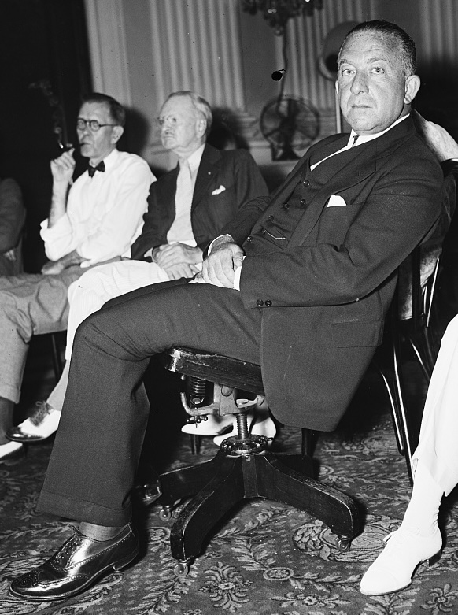{fig-cap-location="margin"}

:::{.notes}
All of this work came under the jurisdiction of a single office in the Department of the Interior, the Division of Territories and Island Possessions or DTIP, established in 1934. The head of DTIP, Ernest Gruening, had a public reputation as a critic of US imperialism. He understood his mission as "to diminish the territories' colonial status."[@grueningMany1973, 181] 

In the course of our research, we've come to believe that Gruening—who was a professional journalist before he became a politician—chose that word "diminish" advisedly. As the administrator of the territorial New Deal, his job was not to ensure independence or even full self-government of the territories, but rather to make them *less* colonial; to provide if you like a durable form of home rule buttressed by material benefits. DTIP and the territorial New Deal were successful in most places with most people, and achieved a great deal in terms of providing relief, prosperity, and a sense of dignity and belonging to US citizens in the territories. Where they failed, or fell short, it was because the basic mission of the New Deal clashed with established and vigorous nationalism.

This observation leads us to the interpretive angle we're working from: the territorial New Deal helps throw the overall New Deal into relief. As our subtitle says, this is the Roosevelt program unchecked: because in the territories—as was emphatically not the case on the mainland—the Supreme Court acknowledged no real impediment to the federal government's writ; because in the territories there were no elections for Congress; therefore in the territories, we can see the New Deal undiluted. Which means we can see how far its most ambitious reformers would go if allowed, and also how they could fail, even when unopposed by conservative jurists and politicians.
:::


## [Per capita New Deal spending, 1934--1936]{.r-fit-text}

:::{.v-center-container}

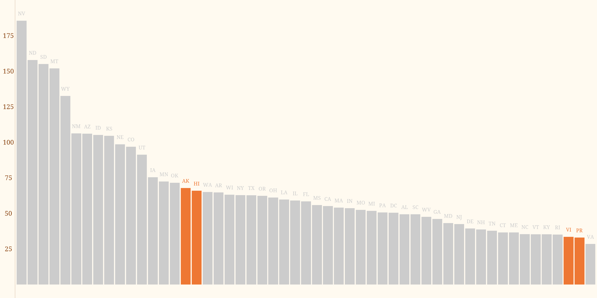{fig-align="center"}

:::


:::{.notes}
Per capita New Deal spending with territories shown in orange. Chart made using `R` and `ggplot` with data from a US Department of Interior document, RG 126, NARA.

There have been many historians, political scientists, and economists who find the New Deal in itself puzzling; it can't possibly be the case, they reason, that the Roosevelt administration merely wanted to make the United States a demonstrably nicer place to live: the whole thing must have been an elaborate vote-buying scheme. (If you think this is a caricature, please note the well known survey of the New Deal that refers to Black Americans as "politically purchased by relief.")[@conkinNewDeal1967, 75; for further examples see @fishbackCan2003; @wallisPolitical1998]

If the New Deal itself is puzzling, then the New Deal in the territories should be even more puzzling. Why would you have a vote-buying program in places where there were no votes to buy?

This chart shows the metric that such analyses generally use, New Deal spending per person. Now, we can give you a caveat here. We wouldn't want to use per capita spending as a metric from which we'd draw any very precise conclusions about the New Deal. The vast bulk of New Deal spending went to infrastructure and specifically to roads; roads often connect places that are far apart and people only live at each end of the road, not along the way. So you would expect a lot of spending in places like Alaska, let's say, where settlements are far apart; a per capita measure wouldn't tell you very much. 

With all those caveats out of the way, the observation we're offering here is that spending per capita in the territories fell in the same general range as spending per capita in the states, which tells us that the New Deal in the territories was broadly comparable to the New Deal in the forty-eight states.

So we have already a first historiographical point of purchase, here, or at least an important question: if you, as a cynical New Dealer, are only and ever out to buy votes with your federal largesse, why would you invest any part of your scarce resources---still less a substantial amount---in territories, places where there were literally no votes to be had?
:::

## Laboratories of reform

:::{.v-center-container}
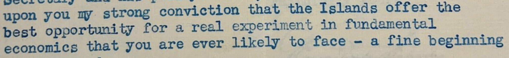
:::

:::{.notes}
But for an even more important historiographical point, we find that in many cases, the New Deal in the territories went further---it was more daring, or experimental---than on the mainland. You can see here an excerpt of a 1935 letter to Roosevelt from a supporter, George Peabody, who describes the Virgin Islands as "the best opportunity for a real experiment in fundamental economics that you are ever likely to face," and other Roosevelt advisors---and, it appears, the president himself---shared this attitude. 

What did that experimentation look like?

:::

## Laboratories: the Virgin Islands{auto-animate=TRUE transition-speed="slow"}

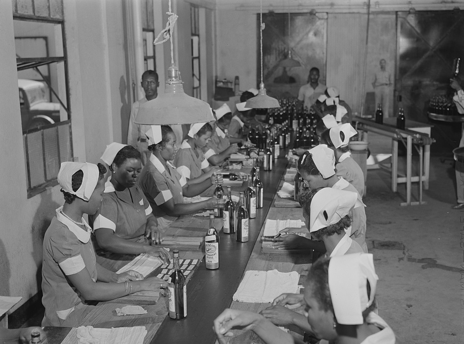{fig-align="center" .column-margin}

:::{.notes}
The US Virgin Islands suffered exceptionally from the Depression because no sooner had the United States bought them from Denmark in 1917 than the republic imposed Prohibition on the poor territory, abolishing rum, the sugar islands' most profitable product. 

The New Deal brought the Virgin Islands not only repeal, but---to spur it onward---a rum-making concern, Government House Rum, wholly owned and operated by the US Department of the Interior.
:::

## Laboratories: the Virgin Islands{auto-animate=TRUE transition-speed="slow"}

:::{layout="[[50,50], [100]]" .column-margin}

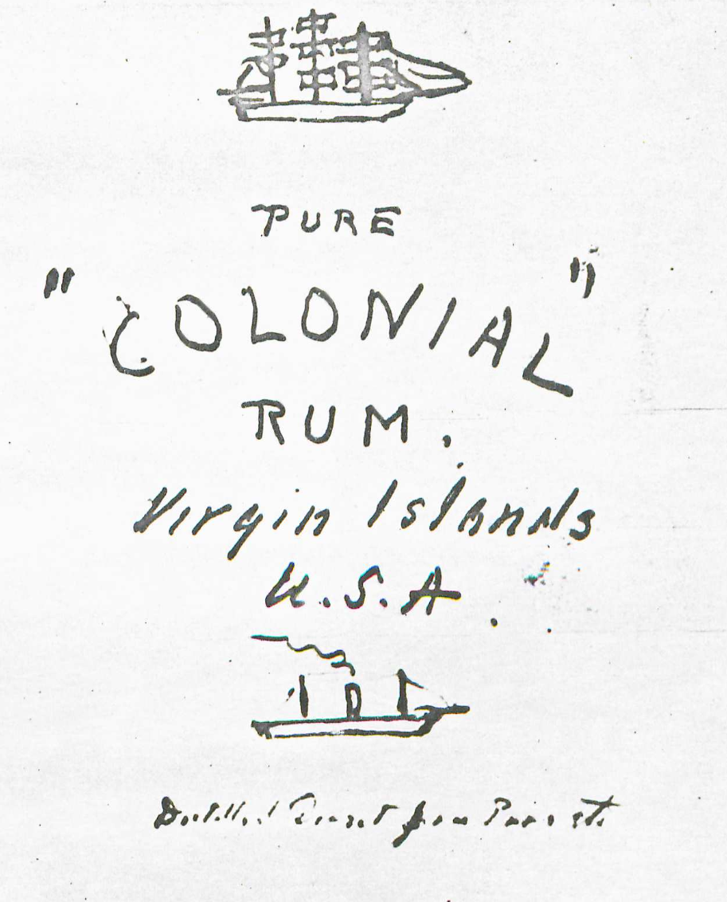{fig-align="center"}

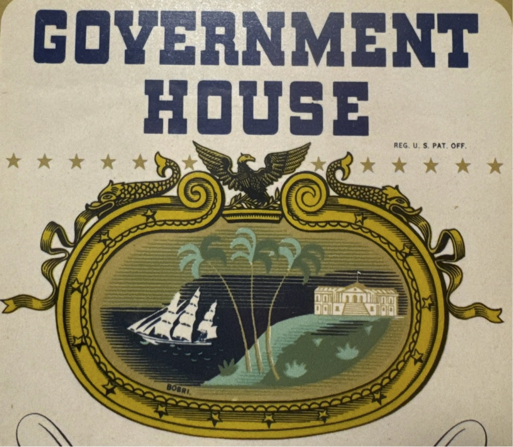{fig-align="center"}

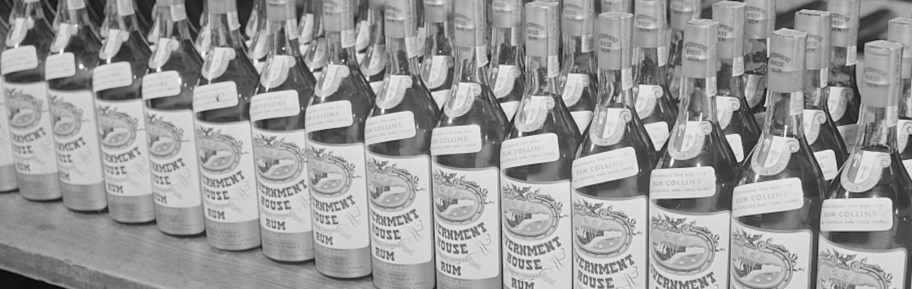{fig-align="center" width="85%"}
:::


:::{.notes}
President Roosevelt took a great deal of pleasure in turning distiller, and even designed the Government House Rum label himself.

As was typical of the territorial New Deal more generally, the president took a personal interest in this program, to the point of saying he had a familial connection through his great-great-grandfather Isaac—who was certainly a sugar merchant but, Roosevelt decided for the purposes of this program, was a rum-maker as well. 

The press took the president's cue and treated the idea of government-made rum with a certain amount of glee; the idea that Uncle Sam had only a couple years before banned the "demon rum" and was now making it himself made a natural story for journalists like Damon Runyon who took to it with the evident gratitude appropriate to a writer handed an easy assignment he can finish ahead of deadline.[@RunyonYoHoHoBottleUSGovernmentRum1937]

The extent to which the reformers and the press had fun with the program shouldn't hide its radicalism. For a start, we're not sure there's another New Deal program in which the US government wholly owned and ran a manufacturing concern whose product went for general sale. Even the Tennessee Valley Authority's fertilizer was given to demonstration farmers in the region or sold to the Agricultural Adjustment Administration.[@AnnualReportTennessee1941, 52]

And there was a more programmatic ambition to Government House that you can see in the president's initial sketch, if not in the final label: note the sailing ship at the top and the steamer at the bottom. This is a program for economic modernization whose scope would make TVA operators blush.
:::


## Laboratories: the Virgin Islands{auto-animate=TRUE transition-speed="slow"}

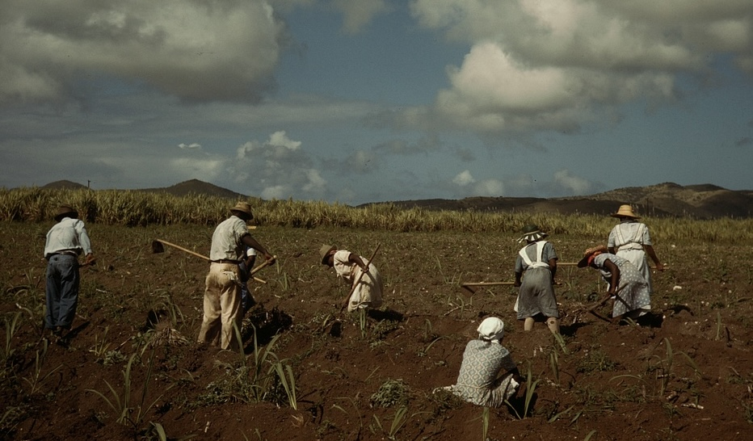{fig-align="center" .column-margin}


:::{.notes}
Government House rum was only the center of a regional development outfit, the Virgin Islands Company, or VICO. As with so much of the New Deal more broadly, VICO took ideas that had been proposed during the Hoover administration, accelerated their implementation, and amplified their impact. Hoover-era reformers had long talked about the need for land redistribution and promoting tourism in the islands. Hoover administrators thought of this as a way to keep Virgin Islanders in the islands and stop them from immigrating to the mainland; specifically, as one said, "the people of the Islands, who are mostly negroes, are educated along cultural lines which do not fit them to make a livelihood"—the Islands' schools were too good; there were no professional jobs for Black Americans; they should be re-tooled for vocational training and the islanders should get subsistence homesteads so they could improve their diets.

Moreover, though the Hoover administration discussed these programs and indeed Congress appropriated funds for them, it did not get them going.

:::


## Laboratories: the Virgin Islands{auto-animate=TRUE transition-speed="slow"}

:::{.v-center-container}
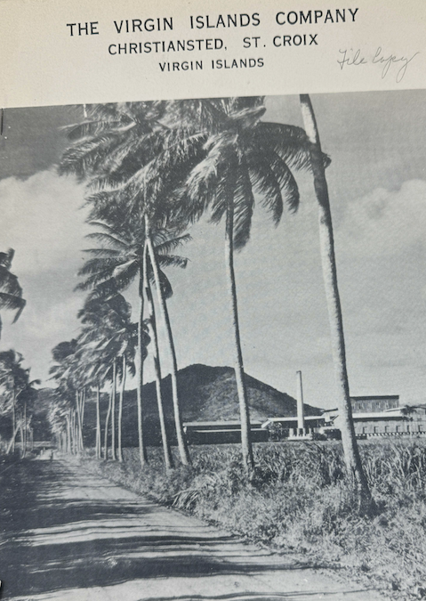{.absolute left=50 top=50 height="90%"}

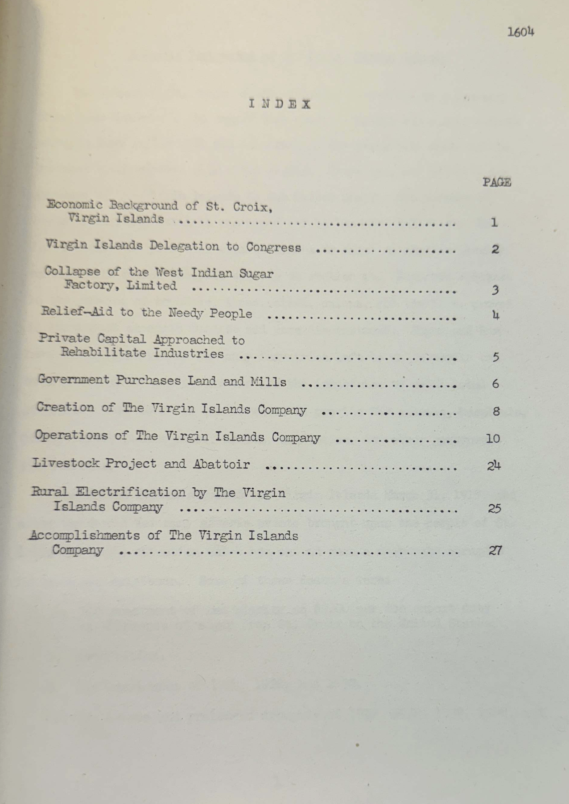{.absolute right=50 top=50 height="90%"}
:::

:::{.notes}
The Roosevelt administration built a tourist hotel and started a homestead program. VICO allocated homesteads only to islanders—in the process, turning down many mainland Americans who were disappointed to learn they could not move to the Caribbean at government expense—and set VICO up as the purchaser of the cane islanders grew. It provided housing to homesteaders as well as land. Rather than limit the homesteads to subsistence produce, VICO made them part of a regional manufacturing economy in which  VICO thus assured an improved income for islanders.

As later economic analyses concluded, the Virgin Islands program of coordinated agricultural, manufacturing, and conservation provided "an effective economic policy" for the islands: "it replaced private enterprise and capital as the core of [the] economy" and "provided full employment for all the people of the island and even started the influx of Puerto Ricans."[@HillMinimumWagesVirginIslands193819681968, 11--12; @taylorWordPictureSt1943, 7; also @usdepartmentoftheinteriorAnnualReportGovernor1939, 23] 

It is a commonplace of the literature that none of the hoped-for sister agencies to the Tennessee Valley Authority, or TVA, ever got built, per William Leuchtenburg's article on the "seven little TVAs"; one could argue that VICO—with its rural electrification program, its livestock and agriculture and regional manufacturing program—was one of them.[For the scope of VICO see e.g. @hunttReport1942; on the never-built TVAs see @leuchtenburgRooseveltNorrisSeven1995] 

:::

## Laboratories: the Virgin Islands{auto-animate=TRUE transition-speed="slow"}

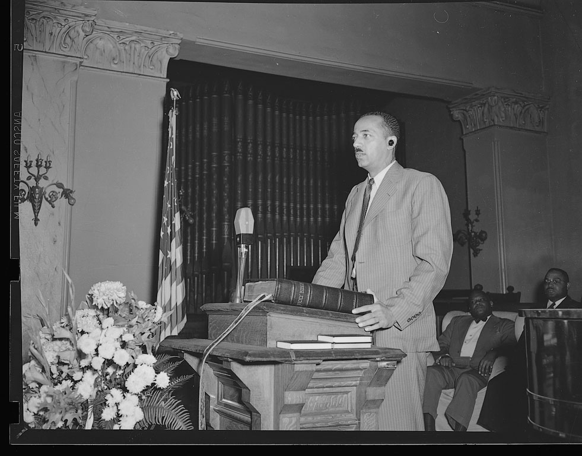{fig-align="center"}

:::{.notes}
Moreover, implementing the New Deal in the Virgin Islands entailed a much firmer commitment to not only jobs, but civil rights, for Black Americans. Danish law in the islands limited suffrage to male citizens over 25 who met property and income qualifications, and who could read English. Black citizens began lobbying for expanded suffrage when the US took over, and when the Roosevelt administration came in, lawyers for the Department of the Interior, led by William Hastie, the NAACP LDF attorney, worked with islanders to come up with a new, more expansive Organic Act. In 1936, Congress passed this law, which removed barriers to voting based on race, class, and gender—confirming women's political equality. The number of registered voters tripled. The act also barred child labor and guaranteed due process and equal protection. Hastie soon became the federal judge for the islands—the first Black federal judge in the United States—and began implementing this law, which he described as "the strongest civil rights law in force in any American State or Territory."[@USDepartmentoftheInteriorAnnualReportGovernorVirginIslandsFiscalYearEndedJune3019471947, 13]
:::

## Laboratories of Americanness

:::{.v-center-container}
```{=revealjs}
  <center>
  <video controls width="700" fig-align="center">
  <source src=./media_onedrive/fdr_trip.mp4 autoplay>
  </video>
  </center>
```
:::

:::{.notes}
Roosevelt's personal involvement was essential to the territorial New Deal generally. In 1934 he visited Puerto Rico, the Virgin Islands, and Hawaiʻi (he would visit Alaska later). As he said when embarking, the trip—and the New Deal—would emphasize that the US citizens of the territories were just as much "fellow Americans" as anyone else. In each of the territories, he gave a speech emphasizing that "the American family" encompassed the territories. [@franklindRadio1934-07-28; @frankind.Radio1934; @frankind.Radio1934]
:::

## Laboratories: Hawaiʻi{transition-speed="slow"}

:::{.v-center-container}
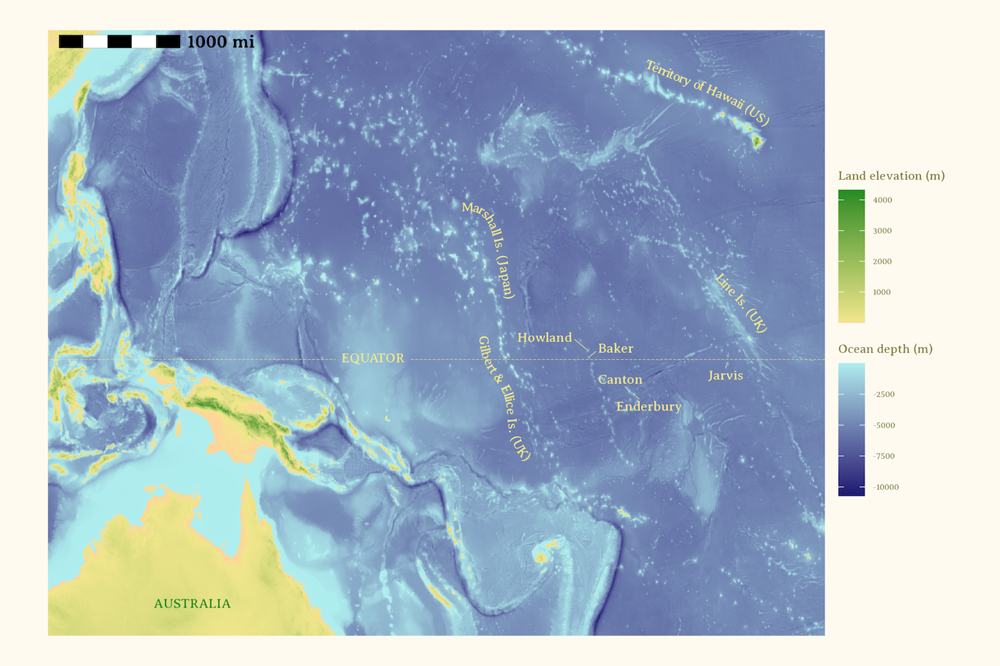{fig-align="center" width="85%"}
:::

:::{.notes}
The territorial New Dealers believed different parts of the American family were best suited to different kinds of jobs. Beginning in 1935, the Roosevelt administration began selecting young Native Hawaiian men from the Kamehameha School for Boys in Honolulu to establish or confirm US claims to the tiny equatorial group of Baker, Howard, and Jarvis islands, which were more than 1000 miles from the Hawaiian isles. On these idyllic beaches, enjoying tropical breezes, these men would fish, surf, and survey the tides and weather. "American citizens of Hawaiian or part-Hawaiian ancestry were selected because of their adaptability to prevailing conditions and their proximity to the Equatorial Islands," as an Interior Department memo explained.[@usdepartmGeneral1942] The settlers, as they were called, initially spent most of their days working to "construct their respective surfboards. . . . playing the ukulele, reading and swimming."[@millerFourth1936, p. entry for September 24, 1936] 

For Roosevelt and other New Dealers, public employment served the purpose not only of ensuring a livelihood, but also of demonstrating to Americans that their government worked for them. As he said in 1932, public employment "will help restore the close relationship with its people which is necessary to preserve our democratic form of government."[@roosevelt1932, 27--29] The Equatorial Islands project served that same purpose for Native Hawaiians involved in it; as one said, "The best part of being on the island is feel good that we doing something, we doing something. You cannot put your finger on it, but it’s a feeling that we’re there for some purpose."[@centerforHui2006, 88]
:::


## Laboratories: Hawaiʻi{auto-animate=TRUE transition-speed="slow"}

:::{.v-center-container}
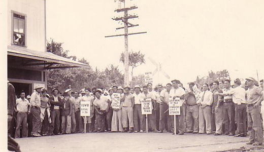{fig-align="center" width="1000"}
:::

:::{.notes}
Transformative power: Wagner Act. 
A handful of shipping, pineapple, and sugar firms—commonly known as the “Big Five”—effectively ran the Hawaiian economy from the 1890s to the 1930s. For decades, to maintain control over their workforce, these oligarchs ruthlessly suppressed unionization among their workers. The passage of New Deal labor laws like the National Labor Relations Act, or Wagner Act, did not initially concern them. When, in 1937, the National Labor Relations Board held a hearing in Honolulu on unfair labor practices, a shipping magnate joked in his testimony that he saw no need to obey the Wagner Act “any more than the Desha Bathing Suit Law,” a seldom enforced local statute requiring a coverup. 
On the sixth day of the hearings, though, the Supreme Court upheld the constitutionality of the Wagner Act. The NLRB told all employers to comply with the law, while the trial examiner in Honolulu found that Hawaiian employers had violated the Wagner act and ordered Castle & Cooke, one of the Big Five, to reinstate with back pay for 11 workers unfairly dismissed during a 1936 strike. The passage of the law (and the Supreme Court decision to uphold it) marked “an unmistakable inflection point in the trajectory of Hawaii’s working class,” according to a leading historian of Hawaiian labor movements.  The federal government made it clear that it would support unions against their employers, even in this Pacific territory.
Before 1937, no union of workers in the pineapple, sugar, or shipping industries had succeeded in winning a contract, or even winning recognition, from their employers. By 1941, newly powerful unions had won contracts in all of Hawaiʻi’s major industries. In 1945, the territorial legislature passed the strongest pro-labor bill in the nation, protecting the right to organize not only for industrial workers but also farm laborers.

:::

## Laboratories: Alaska{auto-animate=TRUE transition-speed="slow"}

:::{.v-center-container}
```{=revealjs}
  <center>
  <video controls width="700" fig-align="center" loop autoplay>
  <source src=./media_onedrive/matanuska_draw.mp4>
  </video>
  </center>
```
:::

:::{.notes}
While Native Alaskans would benefit from the Indian Reorganization Act—which provided at long last a set of rights they had been promised at the time of Alaska's purchase from the United States—perhaps the most ambitious reformist project in Alaska was an identifiably settler-colonial program, the Matanuska Colony. Starting in 1935, social workers in Upper Midwestern states chose destitute farm families to move more than 4,000 miles to the north and west to homestead in the Matanuska Valley near Anchorage. The social workers who chose the 1,000 initial colonists were told to look for experienced, young, and healthy farm families with four to six children, "of Nordic or North European stock"---allegedly because they could withstand the cold and would form a more "homogeneous" society. According to the guidelines given the social workers who chose them, the colonists also needed to be desperately poor, but "because of the depression and not because of factors within themselves."[@Selection] These white pioneers were given 40-acre homesteads and put to work on a collective farm.
:::

## Laboratories: Alaska

:::{.v-center-container}
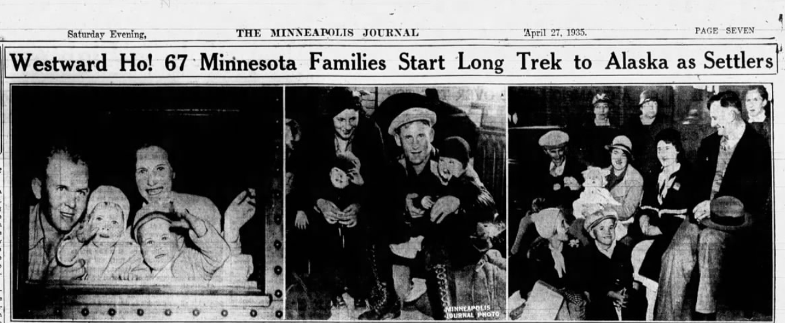
:::

:::{.notes}
Lots of press coverage and excitement.
:::

## Laboratories: Puerto Rico{auto-animate=TRUE transition-speed="slow"}

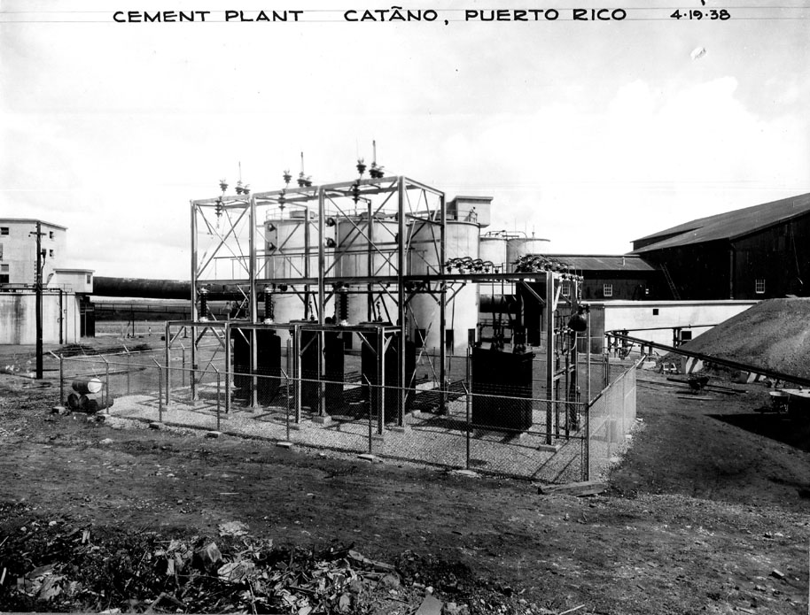{fig-align="center"}

:::{.notes}
In Puerto Rico, we find the imperial nature of the territorial New Deal comes into sharpest relief. Describe PR political economy: much more populous, much poorer, plus regularly battered by hurricanes. Absentee landowners, landless farmworkers. How does ND respond? With lots of same programs as on mainland, with huge effect. Health, vaccinations, hospitals, education, roads. Dams, public power, cement plant. 

Here, reformers—notably, Ernest Gruening who in addition to heading DTIP took personal charge of the Puerto Rico Reconstruction Administration, and Rexford Tugwell, the agricultural economist and later governor of Puerto Rico, as well as Puerto Rican politician and activist Luis Muñoz Marin—started out the New Deal with the ambition of establishing a program with a similar scope to the Virgin Islands Company, but on a much larger scale. They would likewise increase hydroelectric and irrigation capacity for the island, using the facilities of their own cement plant built in consultation with the Tennessee Valley Authority and invest heavily in public health.(Specific reference to the VICO “Report of the Puerto Rico Policy Commission” 1934, 18)

:::

## Laboratories: Puerto Rico

:::{.v-center-container}
```{=revealjs}
  <center>
  <video controls width="700" fig-align="center" loop autoplay>
  <source src=./media_onedrive/nd_puerto_rico.mp4>
  </video>
  </center>
```
:::

:::{.notes}
They would enforce a dormant law restricting the size of single land-holdings and redistribute land as farms to smallholders, with the produce to be bought by publicly owned sugar mills. They would likewise increase hydroelectric and irrigation capacity for the island, using the facilities of their own cement plant built in consultation with the Tennessee Valley Authority and invest heavily in public health. 

While most of this agenda would eventually be implemented and indeed, Puerto Rico would see considerable investment in public works, health, and education, the idea of a central agency carrying it out along the lines of VICO or TVA would fail owing chiefly to the way nationalism was translated into local territorial politics. The dominant faction in Puerto Rico was a coalition between the local Republican Party—which represented business, and specifically sugar, interests—and the local Socialist Party. Unlikely as such a coalition might seem, it made sense because both favored statehood for the archipelago rather than independence, which was the preferred position of the Liberal Party led by Luis Muñoz Marin.

The conservative business interests in Puerto Rico thus had far more political power than anywhere else in the territories, owing to the split over nationalism, and were able to delay New Deal programs. Eventually, the rise of a more aggressive nationalist party in favor of more immediate independence and opposition to the New Deal—because it was a colonialist program—also contributed to the New Dealers’ frustrations there.

:::

## 

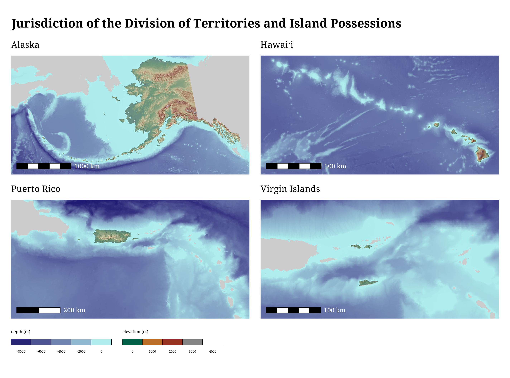{fig-align="center"}

:::{.notes}
Looking at the New Deal in the territories thus provides an analytical advantage that helps us to sort out the essential nature of the Roosevelt program for reform. The one thing pretty much all scholars of the New Deal agree on is that it never went as far as it might have; it was, as William Leuchtenburg said in 1963, a "halfway revolution."[@leuchtenburgFranklinRooseveltNew1963, p. 347] The question is why. 

Many scholars hold that Roosevelt himself, together with other major New Dealers, had moderate ideological beliefs—that the New Deal was self-limiting and never aimed to go more than halfway. There are two schools of thought, here, which we might describe as that the New Deal was quite moderate (derogatory)—that's the position of New Left scholars from Barton J. Bernstein through Colin Gordon—and one is that the New Deal was quite moderate (complimentary)—which remains the position of many biographers and popular historians including notably David M. Kennedy.

On the other hand, many scholars hold that the New Deal's halfway-ness owes chiefly to the strength of its opposition. That's the position of Lawrence Glickman, and indeed of Kathryn S. Olmsted—so perhaps it's unsurprising that our work here tends to reinforce this view.

Or more specifically, we find that the New Deal in the territories provides us with a nice natural experiment. Here the most radical of New Deal reformers found themselves relatively unconstrained by political opposition or judicial constraints. Here they went as far as they could—when they could act with the enthusiastic support of the hitherto forgotten Americans the reformers professed to remember. Their successes were correspondingly greater and their failures, then, were their own.
:::