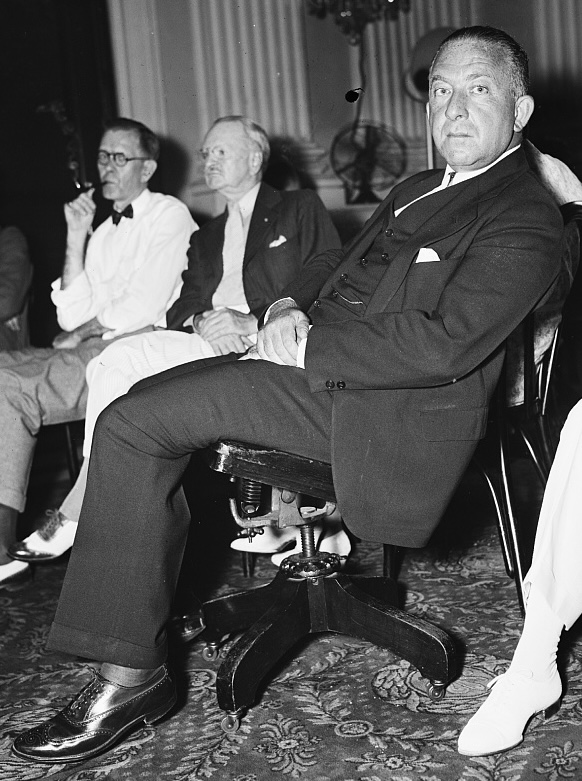
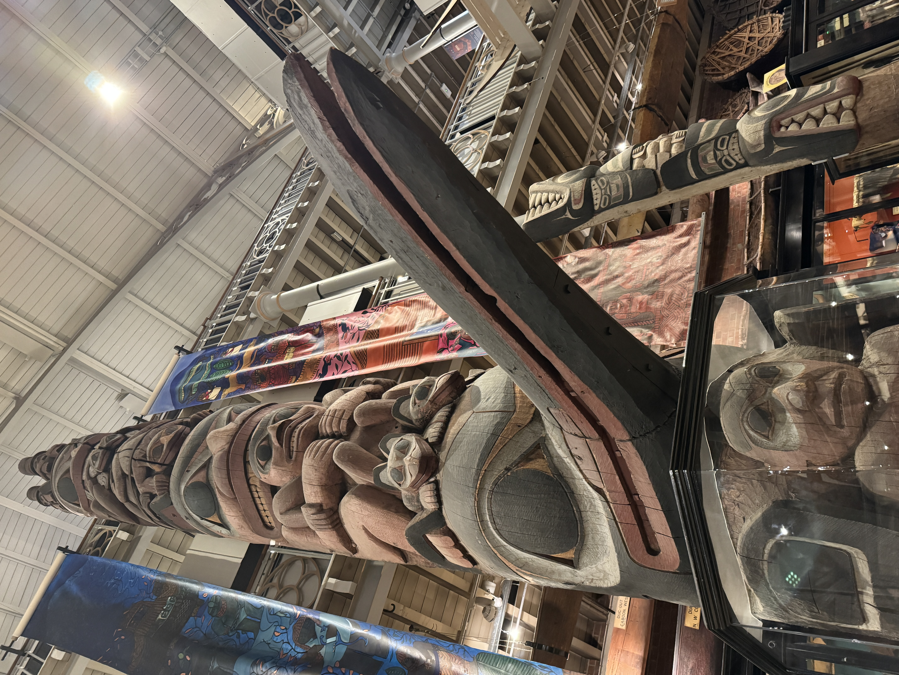
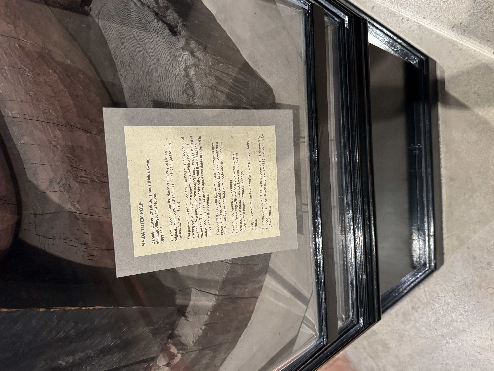

:::{.content-visible when-format="pdf"}

## title slide

:::{.notes}
Thanks to our UCL hosts and to all of you, as ever, for your attention. As you'll have seen, we're presenting a proposal for a book we're co-writing. We're still very much in the stage of formulating and altering our interpretation as we uncover new material. We’ve been to the National Archives and some archives in the US Virgin Islands; and we have still more to go to—in just about a month we’ll go to Alaska and later this summer to the FDR presidential library; we will still need to go to Puerto Rico and some of the National Archives branches, as well as the Library of Congress. So we’re definitely still at a stage of welcoming input. We have just a brief few slides to set the stage and then look forward to your questions.
:::

:::

## Why have a territorial New Deal at all?

:::{.v-center-container .column-margin}

{fig-align="center"}

:::

:::{.notes}

So we're looking at the New Deal in what were then the US territories of Alaska, Hawaiʻi, Puerto Rico, and the Virgin Islands. There were around 2.2 million people in those territories and by the Great Depression they were US citizens. But they couldn't vote for Congress or the president. So the first historiographical point for us is this one. For some historians and especially economists who find it impossible to believe you'd do a New Deal for any reason that's not transactional, there's an analysis of the New Deal that sees it as a vote-buying operation. But why would you have a vote-buying operation where there are no votes to buy?

As you can see here, the per-person cost of the territorial New Deal—which is the metric these scholars generally use, though we have some doubts about its utility and can address that issue in the q&a if you like—the per-person cost of the New Deal in the territories is in the range of the per-person cost of the mainland New Deal. So by the numbers, this is a full New Deal. 
:::

## Laboratories of reform

:::{.v-center-container .column-margin}
{fig-align="center"}
:::

:::{.notes}
A large part of the answer to that question is the one indicated on the slide: the territories offered reformers an opportunity to stretch themselves in a way the mainland did not. The Supreme Court recognized few limits to Washington's power in the territories—as was very much not the case on the mainland—and thus it was possible to do bold things: the Virgin Islands Company, with its federally owned manufacturing concern; or the Equatorial Islands project; or the Matanuska Colony. Or to recognize the civil rights of Black people more plainly than anywhere on the mainland.
:::

## Empire of the New Deal

:::{.v-center-container .column-margin}

{fig-align="center" height="500"}

:::

:::{.notes}
The territorial New Deal came under the jurisdiction of a single office in the Department of the Interior, the Division of Territories and Island Possessions or DTIP, established in 1934. The head of DTIP, Ernest Gruening, had a public reputation as a critic of US imperialism. He understood his mission as “to diminish the territories’ colonial status.”(Gruening 1973, 181)

We think Gruening—who was after all a professional writer—chose that word "diminish" advisedly. He wasn't aiming at independence or statehood, but at a kind of enhanced home rule with the material benefits that came with the New Deal. (As Pedro says in his paper, it was a "reformist colonial" project.)

DTIP and the territorial New Deal were successful in most places with most people, and achieved a great deal in terms of providing relief, prosperity, and a sense of dignity and belonging to US citizens in the territories. Where they failed, or fell short, it was because the basic mission of the New Deal clashed with established and vigorous nationalism.
:::

## Empire of the New Deal

:::{.v-center-container .column-margin}
{fig-align="center" height="500"}
:::

:::{.notes}
To quickly summarize: looking at the New Deal in the territories thus provides an analytical advantage that helps us to sort out the ultimate nature of the Roosevelt program for reform. The one thing pretty much all scholars of the New Deal agree on is that it never went as far as it might have; it was, as William Leuchtenburg said in 1963, a “halfway revolution.”[@leuchtenburgFranklinRooseveltNew1963, 347] The question is why.

Many scholars hold that Roosevelt himself, together with other major New Dealers, had moderate ideological beliefs—that the New Deal was self-limiting and never aimed to go more than halfway. There are two schools of thought, here, which we might describe as that the New Deal was quite moderate (derogatory)—that’s the position of New Left scholars from Barton J. Bernstein through Colin Gordon—and one is that the New Deal was quite moderate (complimentary)—which remains the position of many biographers and popular historians including notably David M. Kennedy.

On the other hand, many scholars hold that the New Deal’s halfway-ness owes chiefly to the strength of its opposition. That’s the position of Lawrence Glickman, and indeed of Kathryn S. Olmsted—so perhaps it’s unsurprising that our work here tends to reinforce this view.

Or more specifically, we find that the New Deal in the territories provides us with a nice natural experiment. Here the most radical of New Deal reformers found themselves relatively unconstrained by political opposition or judicial constraints. Here they went as far as they could—when they could act with the enthusiastic support of the hitherto forgotten Americans the reformers professed to remember.
:::

## Colonialism and colonialism{visibility="uncounted"}

:::{.v-center-container}

{.absolute left=50 top=50 height="80%"}

{.absolute right=50 top=50 height="80%"}
:::

## Colonialism and colonialism{visibility="uncounted"}

:::{.v-center-container}
```{=revealjs}
  <center>
  <video controls loop autoplay width="700" fig-align="center">
  <source src=./media_onedrive/ketch_short.mp4>
  </video>
  </center>
```
:::


## "The forgotten man"{visibility="uncounted"}

:::{.v-center-container}
```{=revealjs}
  <center>
  <video controls loop autoplay width="700" fig-align="center">
  <source src=./media_onedrive/forgotten_bonus.mp4>
  </video>
  </center>
```

:::

## People of the territories{visibility="uncounted"}

:::{.v-center-container}
```{=revealjs}
  <center>
  <video controls loop autoplay width="700" fig-align="center">
  <source src=./media_onedrive/people_territories.mp4>
  </video>
  </center>
```
:::


## A New Deal on the mainland{visibility="uncounted"}

:::{.v-center-container}
```{=revealjs}
  <center>
  <video controls loop autoplay width="700" fig-align="center">
  <source src=./media_onedrive/nd_general.mp4>
  </video>
  </center>
```
:::


## A New Deal in the territories{visibility="uncounted"}

:::{.v-center-container}
```{=revealjs}
  <center>
  <video controls loop autoplay width="700" fig-align="center">
  <source src=./media_onedrive/nd_work_terr.mp4>
  </video>
  </center>
```
:::


## Government House bottling{auto-animate=TRUE transition-speed="slow" visibility="uncounted"}

:::{.content-hidden when-format="pdf"}

{fig-align="center" .column-margin}

:::

## Roosevelt and rum{auto-animate=TRUE transition-speed="slow" visibility="uncounted"}

:::{.content-hidden when-format="pdf"}

:::{layout="[[50,50], [100]]" .column-margin}

{fig-align="center"}

{fig-align="center"}

{fig-align="center" width="85%"}
:::

:::

## Sugar cultivation under VICO{auto-animate=TRUE transition-speed="slow" visibility="uncounted"}

:::{.content-hidden when-format="pdf"}

{fig-align="center" .column-margin}

:::


## The Virgin Islands Company{auto-animate=TRUE transition-speed="slow" visibility="uncounted"}

:::{.content-hidden when-format="pdf"}

:::{.v-center-container .column-margin}
{.absolute left=50 top=50 height="90%"}

{.absolute right=50 top=50 height="90%"}
:::

:::

## William Hastie, 1935{auto-animate=TRUE transition-speed="slow" visibility="uncounted"}

:::{.content-hidden when-format="pdf"}

{fig-align="center" .column-margin}

:::

## Roosevelt's project{visibility="uncounted"}

:::{.v-center-container}
```{=revealjs}
  <center>
  <video controls width="700" fig-align="center">
  <source src=./media_onedrive/fdr_trip.mp4 autoplay>
  </video>
  </center>
```
:::


## Equatorial Islands and Hawaiʻi{transition-speed="slow" visibility="uncounted"}

:::{.content-hidden when-format="pdf"}

:::{.v-center-container .column-margin}
{fig-align="center" width="85%"}
:::

:::


## Labor law: Hawaiʻi{transition-speed="slow" visibility="uncounted"}

:::{.content-visible when-format="revealjs" .v-center-container .column-margin}
{fig-align="center" width="1000"}
:::


## Matanuska homesteaders, Alaska{transition-speed="slow" visibility="uncounted"}

:::{.v-center-container}
```{=revealjs}
  <center>
  <video controls width="700" fig-align="center" loop autoplay>
  <source src=./media_onedrive/matanuska_draw.mp4>
  </video>
  </center>
```
:::


## "Westward Ho," Alaska{transition-speed="slow" visibility="uncounted"}

:::{.content-hidden when-format="pdf"}

:::{.v-center-container .column-margin}

:::

:::

## Cement plant, Puerto Rico{transition-speed="slow" visibility="uncounted"}

:::{.content-hidden when-format="pdf"}

{fig-align="center" .column-margin}

:::

## The New Deal in Puerto Rico{visibility="uncounted"}

:::{.v-center-container}
```{=revealjs}
  <center>
  <video controls width="700" fig-align="center" loop autoplay>
  <source src=./media_onedrive/nd_puerto_rico.mp4>
  </video>
  </center>
```
:::

